# API Functional KATA

## Overview

This project focuses on creating Behavior-Driven Development (BDD) feature files for the API Functional KATA, using the provided Swagger specification as the source of truth.

## Swagger File Location

The Swagger specification file is stored in the repository at:
[booking.yaml](src/test/resources/spec/booking.yaml)

This file defines the API contract, including endpoints, request/response structures, and expected behaviors.

## Feature Files

BDD feature files are created based on the `booking.yaml` specification.  
These feature files describe the expected behavior of the API in a human-readable format and ensure alignment with the API contract.

### Available Feature Files

| Feature File | Description |
|--------------|-------------|
| [authentication_booking.feature](src/test/resources/features/authentication_booking.feature) | Authentication scenarios including token creation and validation (`POST /auth/login`). |
| [create_booking.feature](src/test/resources/features/create_booking.feature) | Scenarios for creating new bookings (`POST /booking`). |
| [delete_booking.feature](src/test/resources/features/delete_booking.feature) | Scenarios for deleting bookings (`DELETE /booking/{id}`). |
| [get_booking.feature](src/test/resources/features/get_booking.feature) | Scenarios for retrieving bookings by ID (`GET /booking/{id}`). |
| [healthcheck_booking.feature](src/test/resources/features/healthcheck_booking.feature) | API health check scenarios (`GET /booking/actuator/health`). |
| [update_booking.feature](src/test/resources/features/update_booking.feature) | Scenarios for updating existing bookings (`PUT /booking/{id}`). |

### Tagging Convention

Tags are used to **categorize and filter scenarios** for easier test execution. They are placed above **Feature** or **Scenario** blocks.

| Tag | Description |
|-----|-------------|
| `@booking` | Relates to hotel booking endpoints (create, get, update, delete). |
| `@createbooking` | Scenarios specific to creating bookings (`POST /booking`). |
| `@deletebooking` | Scenarios specific to deleting bookings (`DELETE /booking/{id}`). |
| `@getbooking` | Scenarios specific to retrieving bookings (`GET /booking/{id}`). |
| `@updatebooking` | Scenarios specific to updating bookings (`PUT /booking/{id}`). |
| `@positive` | Positive test cases verifying expected behavior. |
| `@negative` | Negative test cases verifying error handling and invalid input. |
| `@auth` | Scenarios involving authentication or authorization checks. |
| `@inputvalidation` | Scenarios testing input constraints (e.g., field length, formats). |
| `@exploratory` | Edge-case or exploratory testing scenarios. |
| `@smoke` | Critical path tests for quick validation of key flows. |
| `@integration` | End-to-end tests involving multiple endpoints. |
| `@sanity` | Basic health checks or sanity validation. |
| `@healthcheck` | API health/status endpoints (`GET /booking/actuator/health`). |

## Manual Validation (Bruno)

The Swagger file is imported into Bruno for manual validation of the API.

### Steps

1. Import the Swagger file from:
[booking.yaml](src/test/resources/spec/booking.yaml)
2. Load the collection in Bruno.
3. Execute the requests generated from the Swagger file.
4. Validate that the API responses match the scenarios defined in the feature files.

## Purpose

- Define API behavior using BDD feature files
- Ensure consistency with the Swagger (OpenAPI) specification
- Support manual validation of API endpoints using Bruno

## Tools and Artifacts Used

- **Swagger Editor** (<https://editor.swagger.io/>) – online tool to view Swagger files
- **Bruno (API Client)** – for manual API testing and validation
- **BDD Feature Files** – to define and validate API behavior in a human-readable way (Behavior-Driven Development)

## Observations

Captures discrepancies between the **Swagger (OpenAPI) specification** and the **actual API behavior** observed during testing.

---

### 🔹 Create Booking (`POST /booking`)

| #  | Observation / Issue                                                                 | Screenshot |
|----|-----------------------------------------------------------------------------------|------------|
| 1  | Returns **201** instead of **200**.                                  | 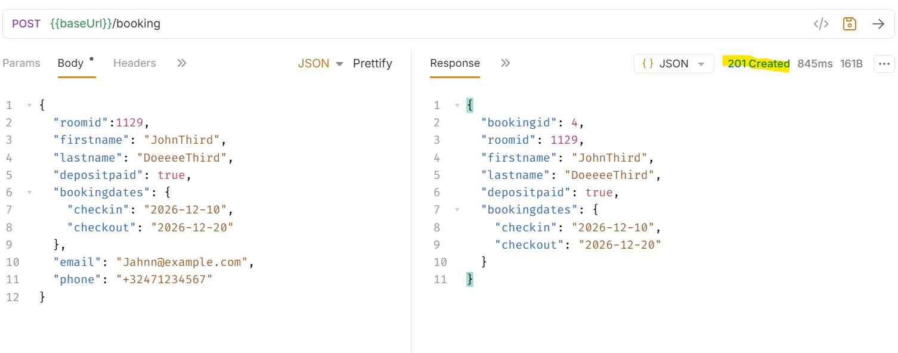 |
| 2  | Missing **booking, email, phone** fields in response.                              | 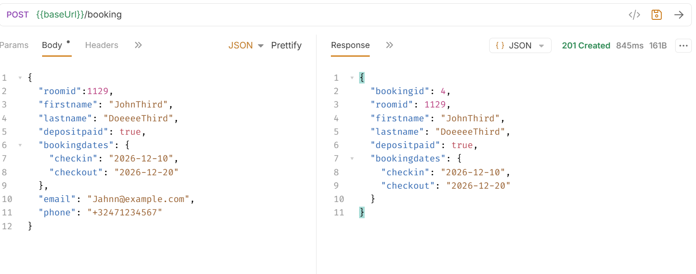 |
| 3  | Allows **back-dated** bookings.                                                    | 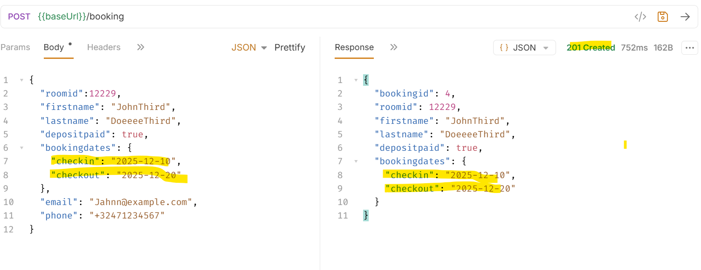 |
| 4  | **Date validation** incorrect; check-in dates modified in response.                | 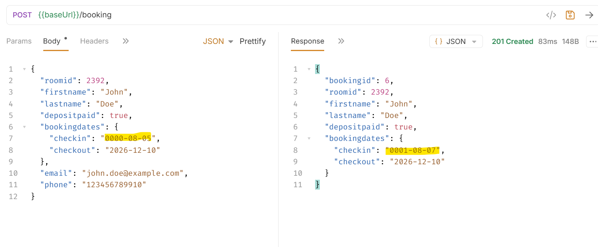 |
| 5  | Last name >18 chars allowed; Swagger specifies **3–18 chars**.                     | 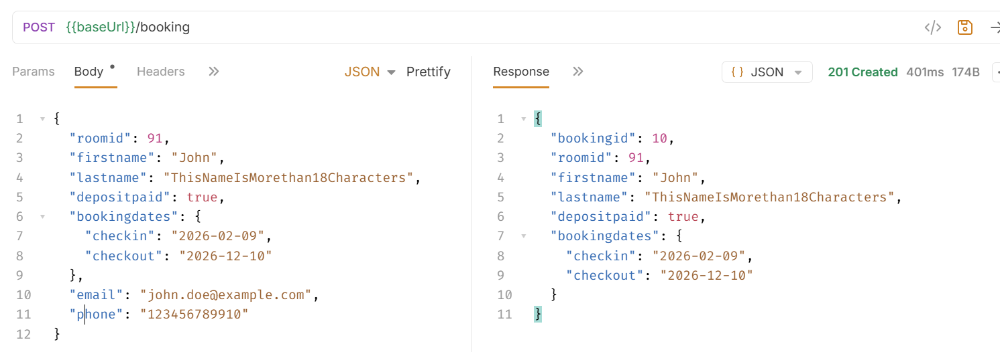 |
| 6  | Last name **>30 chars** triggers error instead of 18-char max.                          | 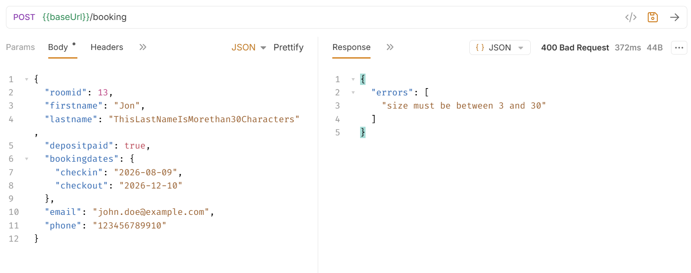 |
| 7  | No error for email with **invalid TLD**.                                           | 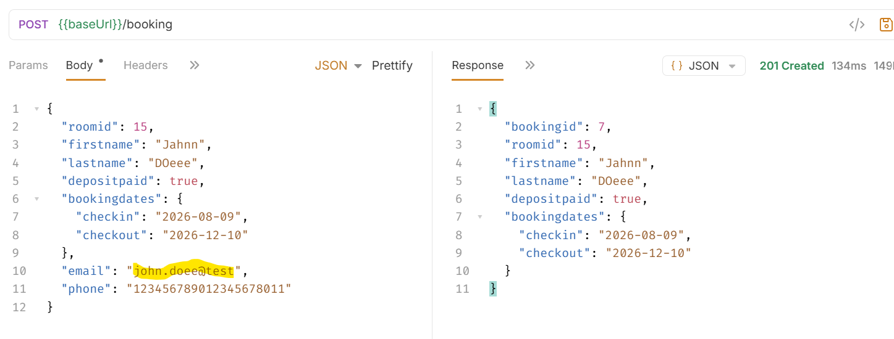 |
| 8  | Duplicate room ID returns **409 Conflict**.                                         | 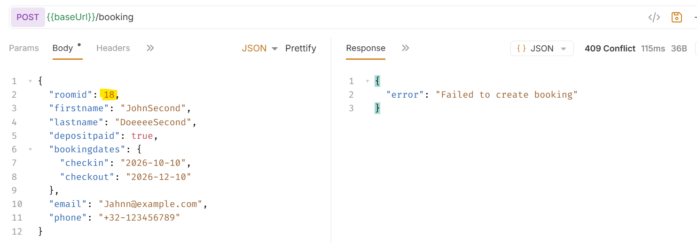 |
| 9  | Check-out before check-in returns **409 Conflict** with `error` key instead of 400/`errors`. | 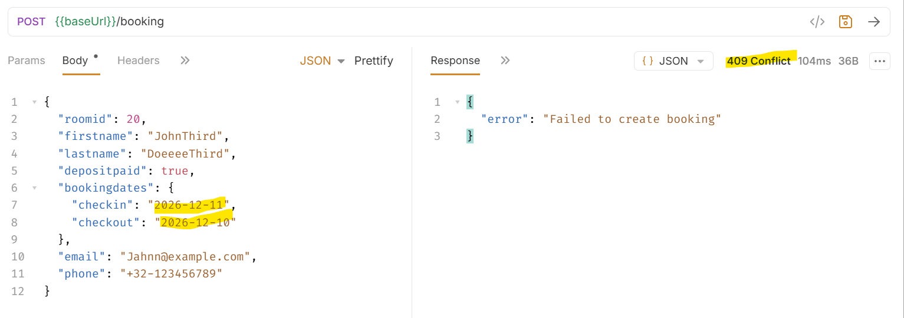 |

---

### 🔹 Delete Booking (`DELETE /booking/{id}`)

| #  | Observation / Issue                                                                 | Screenshot |
|----|-----------------------------------------------------------------------------------|------------|
| 10 | Returns **200** instead of 201; positive flow has **no schema** in swagger.                   | 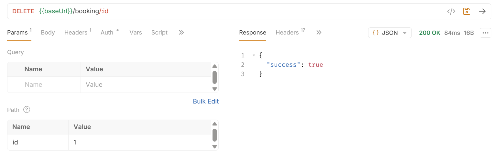 |
| 11 | 401 shows “Authentication required” instead of “Unauthorized”.                     | 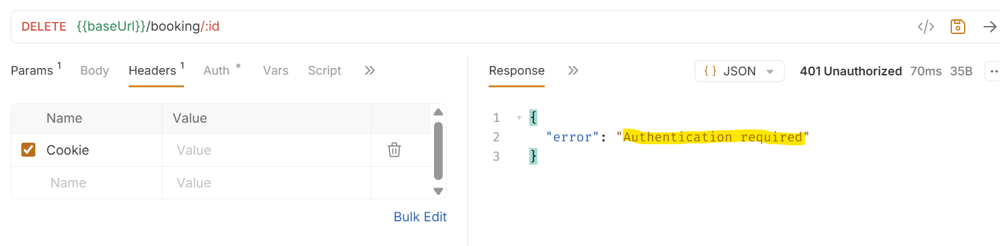 |
| 12 | Missing/invalid token returns **500** instead of 401.                               | 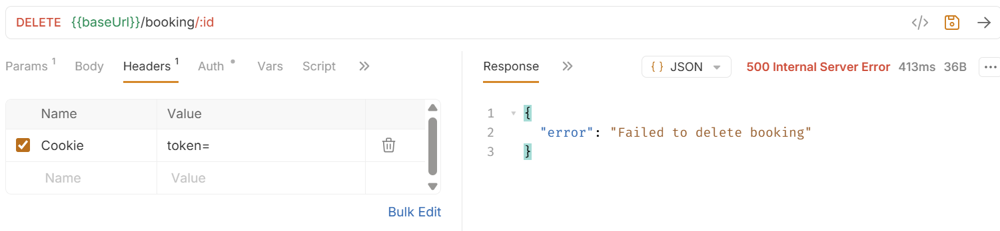 |
| 13 | Invalid booking ID returns **500** instead of 404.                                  | 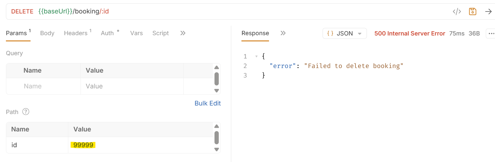 |
| 14 | Deleting same booking twice returns **500** instead of 404.                          | 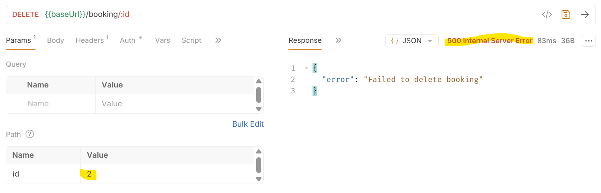 |

---

### 🔹 Get Booking (`GET /booking/{id}`)

| #  | Observation / Issue                                                                 | Screenshot |
|----|-----------------------------------------------------------------------------------|------------|
| 15 | Missing **email, phone**; undocumented **bookingid**.                               | 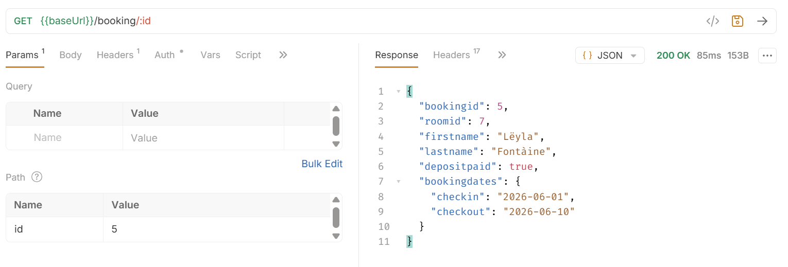 |
| 16 | Token invalid/missing → **403** instead of **401**.                                  | 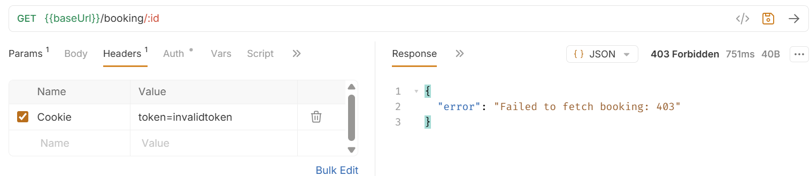 |
| 17 | Invalid **bookingid** → **404**.                                                   | 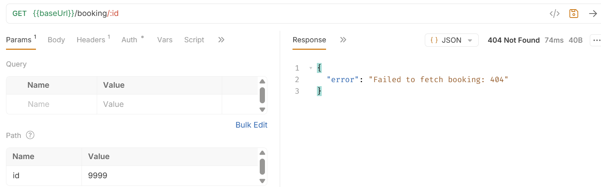 |
| 18 | **401** only for empty/<5 char cookie; wrong error msg.                             | 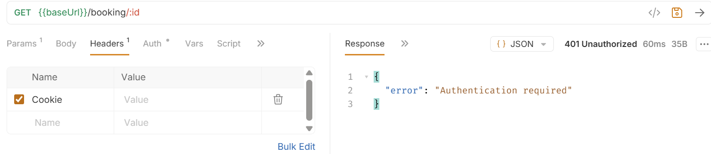 |
| 19 | **400** returned when no bookingid is provided in request.                              | 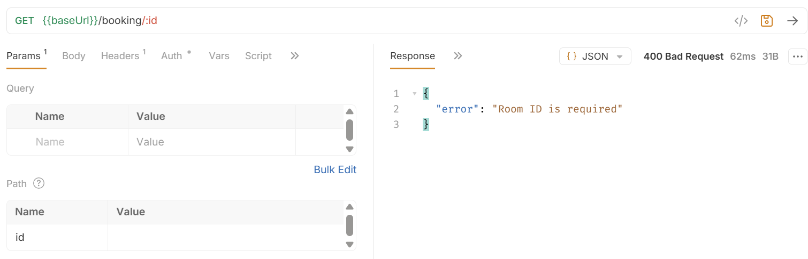 |

---

### 🔹 Authentication (`POST /auth/login`)

| #  | Observation / Issue                                                                 | Screenshot |
|----|-----------------------------------------------------------------------------------|------------|
| 20 | Empty request body throws **500** instead of **400/401**.                                | 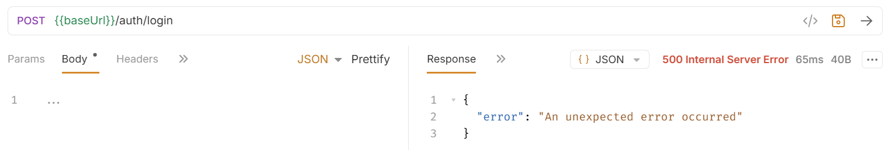 |

---

### 🔹 Update Booking (`PUT /booking/{id}`)

| #  | Observation / Issue                                                                 | Screenshot |
|----|-----------------------------------------------------------------------------------|------------|
| 21 | 200 status returned with **incorrect response schema**, missing booking and client details | 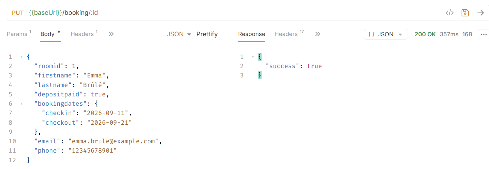 |
| 22 | **401** returned with error message “Authentication required” instead of “Unauthorized” | 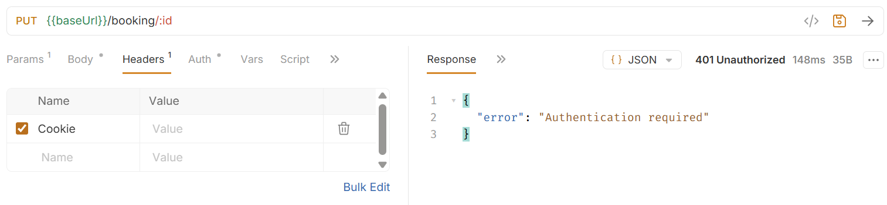 |
| 23 | **403** returned for invalid token.                                                     | 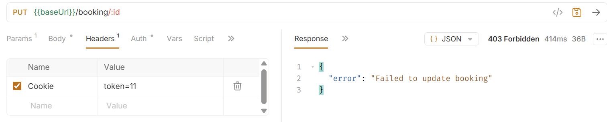 |
| 24 | **500** returned when missing required keys in request.                                  | 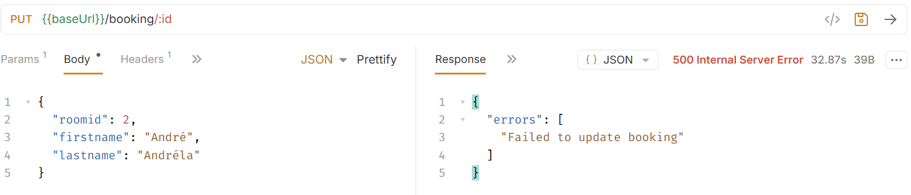 |

## 📌 Summary of Key Findings

Testing revealed several discrepancies between the API implementation and the Swagger specification:

- **Status Code Deviations:** Endpoints return unexpected HTTP codes (e.g., `201` vs `200`, `500` vs `4xx`).  
- **Incomplete or Inconsistent Responses:** Missing or undocumented fields across `Create`, `Get`, `Delete` and `Update` endpoints.  
- **Input Validation Gaps:** Name, email, phone, and date validations are inconsistently enforced; back-dated bookings are allowed.  
- **Authentication & Authorization Issues:** Invalid or missing tokens occasionally return incorrect status codes or messages.  
- **Error Handling Inconsistencies:** Duplicate creation,updation, or deletion attempts, invalid IDs, and missing request data result in improper HTTP responses.  

---

**Recommendation:**  Align the **Swagger contract** or the **API behavior** to ensure consistency and improve test reliability.  
